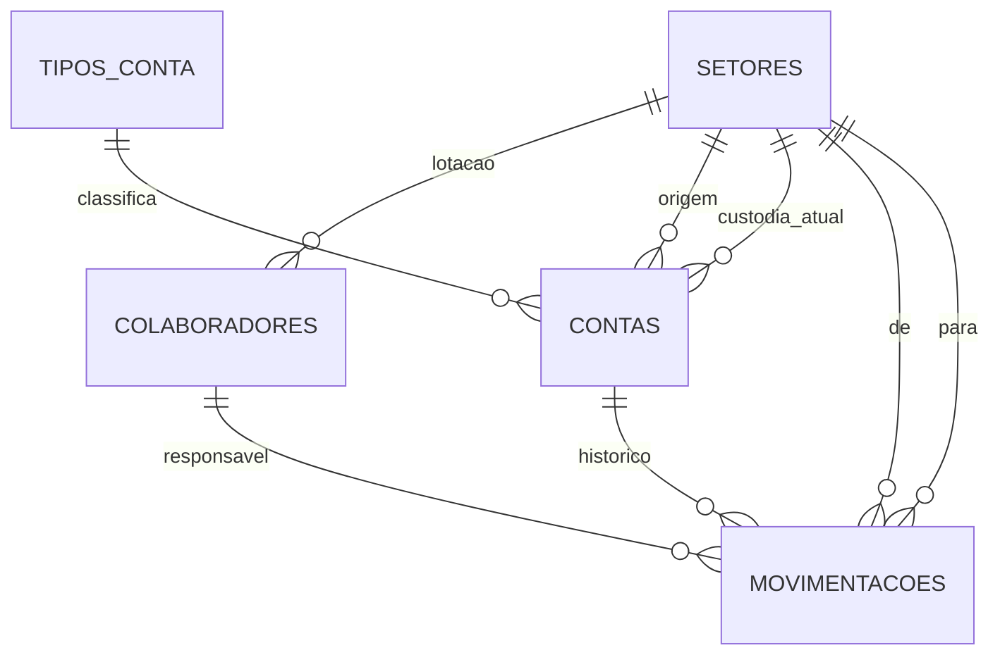

# Movimentador de Contas e Rastreabilidade

Trabalho prático das Semanas 1 a 4. A equipe de DBA e governança provisiona, modela, protege e audita a base do sistema satélite que desloca contas entre setores e guarda o rastro de cada remessa.

Modalidade individual. Não há apresentação em sala.

SGBD: PostgreSQL 15 ou superior. A execução deste repositório foi feita no PostgreSQL 18.6, em 25/09/2026.

## 1. Identificação

| Campo | Informação |
| --- | --- |
| Nome completo | *(Cauã Bolani)* |
| Matrícula / RA | *(preencher antes de entregar)* |
| Curso e turma | *(TADS 4-Periodo)* |
| Disciplina | Administração de banco de dados |
| Papel | DBA e governança |

## 2. O que cada script faz

| Ordem | Arquivo | Função |
| --- | --- | --- |
| 1 | `scripts/01setupdatabase.sql` | Cria a base, os schemas e as tabelas |
| 2 | `scripts/02seeddata.sql` | Carga de setores, colaboradores, contas em trânsito e histórico |
| 3 | `scripts/03securityrbac.sql` | Limpa o schema `public`, cria os papéis e as views da LGPD |
| 4 | `scripts/04auditsetup.sql` | Trilha, RLS e gatilhos de OLD/NEW |
| 5 | `scripts/05attacksimulation.sql` | Tentativas bloqueadas e uma remessa válida |
| 6 | `scripts/06forensicqueries.sql` | Investigação feita pelo auditor |

O script 01 apaga **somente** a base `movimentador_contas` e os papéis didáticos deste trabalho (`usr_*` e `role_*` listados nele). Nenhuma outra base é afetada.

## 3. Como executar

Use o `psql`. Os arquivos têm comandos `\c`, `\echo` e `\set`, que o editor do pgAdmin não executa.

No Windows, o cliente desta máquina fica em `C:\Program Files\PostgreSQL\18\bin\psql.exe`. Se esse diretório não estiver no PATH, chame o executável pelo caminho completo. A autenticação local pede a senha do superusuário.

```powershell
cd "c:\Users\cauaj\Documents\Trabalho banco de dados"
$env:PGCLIENTENCODING = "UTF8"
$psql = "C:\Program Files\PostgreSQL\18\bin\psql.exe"

& $psql -U postgres -h 127.0.0.1 -d postgres -f scripts\01setupdatabase.sql
& $psql -U postgres -h 127.0.0.1 -d postgres -f scripts\02seeddata.sql
& $psql -U postgres -h 127.0.0.1 -d postgres -f scripts\03securityrbac.sql
& $psql -U postgres -h 127.0.0.1 -d postgres -f scripts\04auditsetup.sql
& $psql -U postgres -h 127.0.0.1 -d postgres -f scripts\05attacksimulation.sql
& $psql -U postgres -h 127.0.0.1 -d postgres -f scripts\06forensicqueries.sql
```

O script 05 desliga `ON_ERROR_STOP` de propósito. Os erros 42501 são o bloqueio do SGBD, não falha do arquivo. O script 06 volta a parar no primeiro erro e deve terminar com `06forensicqueries.sql concluido.`

Logins de laboratório, criados pelo script 03. A bateria usa `SET SESSION AUTHORIZATION` a partir do superusuário, então não é preciso conectar com essas senhas para reproduzir o relatório.

| Login | Senha | Papel herdado |
| --- | --- | --- |
| `usr_operador` | `Operador#Trab2026` | `role_operador_movimentacao` |
| `usr_atendimento` | `Atendimento#Trab2026` | `role_atendimento` |
| `usr_auditor` | `Auditor#Trab2026` | `role_auditor` |
| `usr_suporte_legado` | `Legado#Trab2026` | `role_suporte_legado` |
| `usr_intruso` | `Intruso#Trab2026` | nenhum |

## 4. Decisões de modelagem e arquitetura

A base é dedicada ao satélite. O sistema principal não divide tabela com ele. Dentro da base, o schema separa o assunto e o privilégio: quem recebe `USAGE` em `lgpd` não passa a enxergar `identidade`.



| Schema | Conteúdo | Motivo |
| --- | --- | --- |
| `organizacao` | `setores` | Cadastro estável, sem dado pessoal |
| `identidade` | `colaboradores` | CPF e e-mail da equipe, protegidos por coluna |
| `contas` | tipos, contas e movimentações | Operação e histórico de rastreabilidade |
| `lgpd` | views mascaradas | Única superfície do atendimento |
| `auditoria` | `trilha` | Append-only, fora do modelo operacional |

Decisões que sustentam a rastreabilidade:

- Toda chave estrangeira usa `ON DELETE RESTRICT`. Apagar um setor ou um titular não apaga o histórico em cascata.
- `contas.movimentacoes` não aceita origem e destino iguais. Uma remessa é um deslocamento real.
- O status da conta é um domínio fechado: `EM_TRANSITO`, `RECEBIDA`, `BLOQUEADA`, `ENCERRADA`.
- O saldo não pode ser negativo. Nenhum papel de aplicação recebe essa coluna: o satélite desloca a conta, não opera o caixa.
- CPF e e-mail da carga são fictícios, no domínio reservado `exemplo.invalid`. O formato do CPF é de 11 dígitos.
- A trilha não tem chave estrangeira para as tabelas de negócio. O registro do incidente continua mesmo que a linha operacional deixe de existir.

A carga do script 02 acontece **antes** dos gatilhos. A trilha passa a valer quando a auditoria é instalada. Os cinco protocolos `MOV-2026-0001` a `MOV-2026-0005` são o histórico de referência. O incidente da bateria tenta apagar o primeiro.

## 5. Controle de acesso e LGPD

O schema `public` perde `USAGE` e `CREATE` para `PUBLIC`. O banco também perde `CONNECT` para `PUBLIC`. Cada login recebe `CONNECT` na mão. Objeto novo não nasce acessível por omissão.

Os papéis funcionais são `NOLOGIN`. O login herda um papel só. `usr_intruso` herda nenhum: é o teste de quem chegou a conectar e não tem função.

| Papel | Pode | Não pode |
| --- | --- | --- |
| Operador | Ler número, status e setor; atualizar status e setor atual; inserir movimentação; ler views mascaradas | CPF, e-mail, saldo, `DELETE`, `TRUNCATE`, trilha |
| Atendimento | `SELECT` nas duas views | Qualquer tabela base |
| Auditor | Views mascaradas e `SELECT` na trilha | Escrever na operação ou na trilha |
| Suporte legado | `SELECT` e `DELETE` em `movimentacoes` | O `DELETE` não conclui: o gatilho cancela a linha |
| `role_audit_definer` | `INSERT` na trilha, via função `SECURITY DEFINER` | Login |

A view `lgpd.vw_contas_mascaradas` é `security_barrier` e `security_invoker = false`. O DBA, dono da view, lê a tabela. O chamador só recebe número, tipo, primeiro nome com inicial, CPF no formato `456.***.***-64`, e-mail no formato `h***@exemplo.invalid`, setores e status. Saldo não entra na view.

As funções de máscara só transformam o texto que recebem. O `EXECUTE` fica restrito a operador, atendimento e auditor, porque o PostgreSQL verifica esse privilégio no chamador mesmo com a view no modo do dono. `usr_intruso` não está na lista.

CPF, neste modelo, é dado pessoal (art. 5º, I, da LGPD), não dado pessoal sensível (art. 5º, II). A minimização (art. 6º, III) está na view. A medida técnica de segurança (art. 46) está no privilégio de coluna, no schema e na trilha.

A trilha guarda OLD e NEW integrais, incluindo dado pessoal quando a linha de `contas` muda. Quem lê isso é só `role_auditor`, com RLS ativo e forçado para o dono da tabela. A consulta do relatório projeta protocolo, status e autoria, sem republicar o JSON inteiro.

O gatilho grava `session_user`. Dentro de função `SECURITY DEFINER`, `current_user` vira `role_audit_definer` e esconderia o autor.

O `DELETE` do histórico é barrado com `RETURN NULL` no `BEFORE DELETE`. A linha de auditoria entra na mesma transação e permanece. Um `RAISE EXCEPTION` desfaria a evidência junto com o `DELETE`, porque o PostgreSQL não tem transação autônoma. `TRUNCATE` e qualquer `UPDATE`/`DELETE` na própria trilha usam exceção: nesses casos a prova é o erro 42501 devolvido ao cliente.

## 6. Relatório forense

Ambiente da captura: PostgreSQL 18.6, host `127.0.0.1`, fuso `America/Sao_Paulo`, em 25/09/2026. A saída integral está em `evidencias/05-ataque.txt` e `evidencias/06-forense.txt`. Os trechos abaixo são dessa execução. O código SQLSTATE `42501` é `insufficient_privilege`.

### 6.1 Coluna permitida e coluna restrita

O operador lê número e status. Na sentença seguinte, CPF, e-mail e saldo são recusados. O `SELECT *` também cai, porque expandiria as colunas sem grant. Nesta versão do servidor a mensagem cita a tabela, não o nome da coluna: a coluna restrita não tem ACL própria, e o papel também não tem `SELECT` de tabela. A diferença entre o T03 e o T04 é o efeito do privilégio de coluna.

```text
========== T03 operador le apenas numero e status (esperado: sucesso) ==========
 usuario_da_tentativa
----------------------
 usr_operador

  numero  |   status
----------+-------------
 100100-1 | EM_TRANSITO
 100200-7 | RECEBIDA
 100300-4 | EM_TRANSITO
 100400-2 | RECEBIDA
 100500-9 | BLOQUEADA
 100600-5 | EM_TRANSITO
(6 linhas)

========== T04 operador le CPF, e-mail e saldo (esperado: 42501) ==========
ERRO:  42501: permissão negada para tabela contas
```

O mesmo operador não lê CPF do colaborador (T05), não apaga movimentação (T07) e não esvazia o histórico (T08). As três respostas são `42501`.

### 6.2 Atendimento não alcança a tabela base

`usr_intruso` e `usr_atendimento` nem entram no schema `contas`. O atendimento também não atualiza status.

```text
========== T01 intruso le contas.contas (esperado: 42501) ==========
ERRO:  42501: permissão negada para esquema contas

========== T09 atendimento le a tabela base (esperado: 42501) ==========
ERRO:  42501: permissão negada para esquema contas

========== T10 atendimento altera status (esperado: 42501) ==========
ERRO:  42501: permissão negada para esquema contas
```

A consulta permitida devolve a view mascarada. Não há coluna de saldo nem CPF integral.

```text
========== T11 atendimento consulta a view mascarada ==========
  numero  |  titular  | cpf_mascarado  |   email_mascarado    |    setor_atual    |   status
----------+-----------+----------------+----------------------+-------------------+-------------
 100100-1 | Helena P. | 456.***.***-64 | h***@exemplo.invalid | Operacoes         | EM_TRANSITO
 100200-7 | Igor S.   | 321.***.***-91 | i***@exemplo.invalid | Tesouraria        | RECEBIDA
 100300-4 | Julia F.  | 987.***.***-00 | j***@exemplo.invalid | Compliance        | EM_TRANSITO
 100400-2 | Laura P.  | 135.***.***-28 | l***@exemplo.invalid | Contas a Receber  | RECEBIDA
 100500-9 | Marcos T. | 246.***.***-28 | m***@exemplo.invalid | Compliance        | BLOQUEADA
 100600-5 | Nina B.   | 102.***.***-41 | n***@exemplo.invalid | Auditoria Interna | EM_TRANSITO
(6 linhas)
```

### 6.3 Tentativa de apagar o histórico

`usr_suporte_legado` ainda tem `DELETE`, resíduo de um papel antigo. O gatilho cancela a exclusão, grava OLD, usuário e instante, e a linha original continua.

```text
========== T12 suporte legado apaga MOV-2026-0001 ==========
 usuario_da_tentativa
----------------------
 usr_suporte_legado

AVISO:  01000: RASTREABILIDADE: exclusao do protocolo MOV-2026-0001 bloqueada e registrada (usuario usr_suporte_legado)
DELETE 0
   protocolo   |                 motivo
---------------+----------------------------------------
 MOV-2026-0001 | Encaminhamento da conta para operacoes
(1 linha)
```

`DELETE 0` com a linha ainda presente é o bloqueio. O mesmo login não consegue alterar o motivo (T13, `42501`).

A sessão administrativa (`postgres`) também não adultera a trilha nem esvazia o histórico. Depois do `TRUNCATE` recusado, as cinco movimentações de carga continuam lá.

```text
========== T14 sessao administrativa adultera a trilha ==========
ERRO:  42501: AUDITORIA-IMUTAVEL: UPDATE na trilha e proibido (usuario postgres)

========== T15 sessao administrativa apaga a trilha ==========
ERRO:  42501: AUDITORIA-IMUTAVEL: DELETE na trilha e proibido (usuario postgres)

========== T16 sessao administrativa faz TRUNCATE do historico ==========
ERRO:  42501: RASTREABILIDADE: TRUNCATE em contas.movimentacoes e proibido (usuario postgres)
 movimentacoes_preservadas
---------------------------
                         5
```

O auditor não apaga a trilha (T17). O operador não a consulta (T18). Os dois recebem `42501`.

### 6.4 Operação válida, para contraste

O operador registra a remessa da conta `100200-7`, da Tesouraria para Operações, e atualiza o status. Isso deve aparecer na trilha como autoria diferente do incidente.

```text
========== T19 operador executa remessa valida da conta 100200-7 ==========
 usuario_da_tentativa
----------------------
 usr_operador

INSERT 0 1
UPDATE 1
  numero  |   status
----------+-------------
 100200-7 | EM_TRANSITO
```

A conferência do superusuário ainda lista `MOV-2026-0001` até `MOV-2026-0005` e conta 3 eventos na trilha: o bloqueio, o `INSERT` e o `UPDATE`.

### 6.5 Consulta final, como auditor

O script 06 conecta a investigação em `usr_auditor`. Esse login não lê tabela base. A conclusão sai da trilha e das views.

```text
 investigador | papel_efetivo
--------------+---------------
 usr_auditor  | usr_auditor

========== F1. Autoria agregada ==========
       autor        |    tabela     | operacao | bloqueado | eventos
--------------------+---------------+----------+-----------+---------
 usr_operador       | contas        | UPDATE   | f         |       1
 usr_operador       | movimentacoes | INSERT   | f         |       1
 usr_suporte_legado | movimentacoes | DELETE   | t         |       1

========== F2. Incidente ==========
 id |          ocorrido_em          |       autor        | endereco_cliente |       aplicacao        | operacao | bloqueado |   protocolo   |           motivo_preservado
----+-------------------------------+--------------------+------------------+------------------------+----------+-----------+---------------+----------------------------------------
  1 | 2026-09-25 16:52:08.341087-03 | usr_suporte_legado | 127.0.0.1        | cliente_suporte_legado | DELETE   | t         | MOV-2026-0001 | Encaminhamento da conta para operacoes

========== F6. Linha do tempo ==========
 id |     ocorrido_em     |       autor        |    tabela     | operacao | bloqueado |          referencia
----+---------------------+--------------------+---------------+----------+-----------+------------------------------
  1 | 2026-09-25 16:52:08 | usr_suporte_legado | movimentacoes | DELETE   | t         | MOV-2026-0001
  2 | 2026-09-25 16:52:08 | usr_operador       | movimentacoes | INSERT   | f         | MOV-VALIDO-20260925165208345
  3 | 2026-09-25 16:52:08 | usr_operador       | contas        | UPDATE   | f         | 100200-7
```

O OLD/NEW do status, na consulta F3, mostra a remessa lícita: status `RECEBIDA` passou a `EM_TRANSITO`, setor `1` (Tesouraria, primeiro setor da carga) passou a setor `2` (Operações). A view confirma o estado visível ao auditor, sem CPF integral:

```text
========== F5. Estado atual da conta movimentada de forma valida ==========
  numero  | titular | cpf_mascarado  | setor_origem | setor_atual |   status
----------+---------+----------------+--------------+-------------+-------------
 100200-7 | Igor S. | 321.***.***-91 | Atendimento  | Operacoes   | EM_TRANSITO
```

O protocolo atacado não sumiu. A view de rastreabilidade ainda o mostra, da Contas a Receber para Operações, matrícula 1003:

```text
========== F4. O protocolo atacado continua visivel ==========
   protocolo   |  conta   |   setor_origem   | setor_destino | matricula_responsavel |                 motivo
---------------+----------+------------------+---------------+-----------------------+----------------------------------------
 MOV-2026-0001 | 100100-1 | Contas a Receber | Operacoes     | 1003                  | Encaminhamento da conta para operacoes
```

### Conclusão da investigação

Em 25/09/2026, às 16:52:08 (-03), o login `usr_suporte_legado`, a partir de `127.0.0.1`, pela aplicação `cliente_suporte_legado`, tentou apagar o protocolo `MOV-2026-0001`. O gatilho cancelou a exclusão, guardou o motivo original ("Encaminhamento da conta para operacoes") e marcou `bloqueado = true`. A conta `100100-1` segue em trânsito para Operações.

Segundos depois, `usr_operador`, pela aplicação `app_movimentador`, incluiu a remessa `MOV-VALIDO-20260925165208345` e mudou a conta `100200-7` de recebida na Tesouraria para em trânsito em Operações. Essa escrita é válida e está separada do incidente pelo autor, pela operação e pela flag `bloqueado`.

## 7. Limites deste controle

- Superusuário pode desligar gatilho (`DISABLE TRIGGER`) e ignorar RLS. A proteção contra a sessão administrativa existe enquanto o gatilho está ligado. Desligá-lo é incidente de governança, não um buraco silencioso.
- `TRUNCATE` e a tentativa de alterar a trilha geram erro e não deixam linha nova: a exceção desfaz o `INSERT` da mesma transação. A prova desses dois casos é a mensagem 42501. O `DELETE` de movimentação deixa linha porque é cancelado com `RETURN NULL`, sem abortar a transação.
- As senhas dos logins são de laboratório. Em ambiente real elas não ficam no script e o acesso administrativo não é compartilhado.
- A mensagem de coluna restrita, neste PostgreSQL, cita a tabela. O T03 mostra que as colunas concedidas continuam legíveis.
